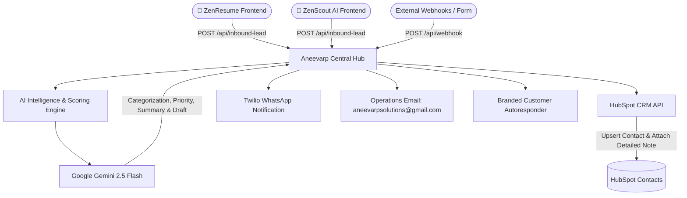

# 🏢 Aneevarp Solutions — Central Inbound Operations & Lead Hub


An enterprise-grade, multi-product inbound operations and intelligence engine tailored for **Aneevarp Solutions** (MSME: `UDYAM-AP-10-0144446`), the software parent enterprise operating:
1. 📄 **ZenResume** ([zenresume.online](https://www.zenresume.online)) — Free ATS Resume Builder & Career Hub
2. 🤖 **ZenScout AI** ([ai-job-search-agent-chi.vercel.app](https://ai-job-search-agent-chi.vercel.app)) — Autonomous AI Job Search & Matching Agent

Whenever users, colleges, or companies submit feedback, support tickets, partnership requests, or B2B enterprise leads on ZenResume or ZenScout AI, this central hub ingests the payload, categorizes it with Gemini 2.5 Flash, updates HubSpot CRM, alerts the founder via Twilio WhatsApp, notifies central operations via email, and dispatches a branded customer autoresponder.

---

## 🏗️ Multi-Product Inbound Architecture



---

## 🎯 Intelligent Categorization Engine

Incoming tickets are classified into one of 5 enterprise categories:

| Category | Description | Target Flow |
| :--- | :--- | :--- |
| **`B2B Enterprise Lead`** | Corporate licensing, HR Tech integration, recruitment platform tie-ups | High priority score, logged to CRM as qualified lead, instant founder alert. |
| **`University Placement Partnership`** | Colleges, TPOs, university placement cells wanting student bulk licenses | High priority score, CRM lead record created, partnership draft prepared. |
| **`Feature Suggestion`** | User feedback, product ideas, UI/UX recommendations | Routed to product roadmap backlog, auto-thanked. |
| **`Customer Support`** | Account questions, resume parsing help, job search assistance | Empathetic resolution draft generated and sent to user. |
| **`Bug Report`** | Error logs, broken buttons, UI glitches, 403/500 errors | Flagged as urgent/high priority, technical note created in CRM. |

---

## 🌐 API Reference

### `POST /api/inbound-lead` (CORS Enabled)

Integrate this endpoint directly from your React, Next.js, or HTML frontends.

**Request Payload:**
```json
{
  "product": "ZenResume",
  "name": "Dr. Rajesh Kumar",
  "email": "placements@university.edu.in",
  "phone": "+91 9876543210",
  "type": "partnership",
  "company": "Andhra University",
  "role": "Placement Director",
  "rating": 5,
  "message": "We want to partner with ZenResume for 2,000 engineering students in our 2026 placement drive."
}
```

**Response (200 OK):**
```json
{
  "status": "success",
  "product": "ZenResume",
  "category": "University Placement Partnership",
  "priority": "High",
  "score": 95,
  "summary": "University Placement Director reaching out to onboard 2,000 students onto ZenResume for 2026 drive.",
  "crm_synced": true,
  "autoresponder_sent": true,
  "email_draft": "Dear Dr. Rajesh Kumar, thank you for reaching out to ZenResume..."
}
```

---

## 🚀 Live Integration Snippet (Client-Side JS)

```javascript
async function submitInboundTicket(formData) {
  const response = await fetch("https://your-crm-hub.onrender.com/api/inbound-lead", {
    method: "POST",
    headers: { "Content-Type": "application/json" },
    body: JSON.stringify({
      product: "ZenScout AI",
      name: formData.name,
      email: formData.email,
      phone: formData.phone,
      type: "support",
      rating: 5,
      message: formData.message
    })
  });
  return await response.json();
}
```

---

## ⚙️ Environment Variables (`.env`)

```env
# Google Gemini Intelligence
GEMINI_API_KEY=your_gemini_api_key

# HubSpot CRM API
HUBSPOT_ACCESS_TOKEN=pat-na2-...

# Email Notifications & Autoresponder
SENDER_EMAIL=your_email@gmail.com
SENDER_APP_PASSWORD=your_gmail_app_password
CRM_TEAM_EMAIL=aneevarpsolutions@gmail.com

# Twilio WhatsApp Alerts
TWILIO_ACCOUNT_SID=your_twilio_sid
TWILIO_AUTH_TOKEN=your_twilio_token
TWILIO_WHATSAPP_NUMBER=+14155238886
CRM_HEAD_WHATSAPP_NUMBER=+918790906267
```

---

## ☁️ Deployment

Configured with `gunicorn app:app --timeout 120` in `Procfile` and full CORS support for instant deployment on **Render**, **Heroku**, or **AWS**.
