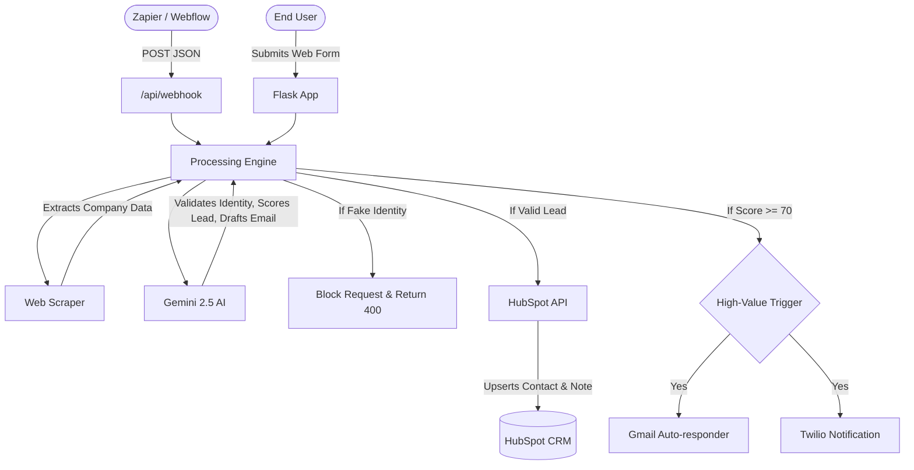
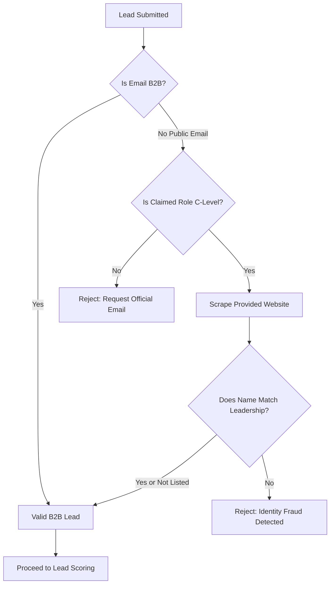

# 🚀 AI Sales Operations Agent


An enterprise-grade, autonomous inbound lead processing engine. This system intercepts inbound leads (via web forms or webhooks), performs real-time web scraping, validates user identity to prevent fraud, and uses **Google Gemini 2.5 Flash** to score the lead and draft hyper-personalized outreach emails. Qualified leads are automatically pushed to **HubSpot CRM**, and high-value targets instantly trigger **Twilio WhatsApp** and **Gmail** alerts.

---

## 🏗️ System Architecture

The following diagram illustrates the data flow from lead ingestion to CRM synchronization and alerting.



---

## ✨ Core Features

- **Multi-Channel Ingestion:** Accepts leads via a beautiful frontend UI or headlessly via REST API webhooks.
- **Intelligent Web Scraping:** Automatically visits the lead's company website to extract their core business offerings.
- **AI Identity Verification:** Cross-references the lead's claimed role and name against their website's leadership team to automatically block impersonators.
- **Automated Lead Scoring:** Uses a strict 100-point B2B rubric to categorize leads into Hot, Warm, or Cold based on company size, role, and budget urgency.
- **Hyper-Personalization:** Gemini drafts a unique introductory email referencing specific data extracted from the company's website.
- **HubSpot Integration:** Creates or updates contacts seamlessly, preventing duplicates via 409 Conflict handling, and logs the AI analysis as a CRM Note.

---

## 🕵️ AI Anti-Fraud Workflow

To maintain CRM data integrity, the system employs a multi-stage identity verification process before any database mutation occurs.



---

## ⚙️ Installation & Setup

### Prerequisites
- Python 3.10+
- Google Gemini API Key
- HubSpot Private App Token (with `crm.objects.contacts.write` and `crm.objects.notes.write` scopes)
- Twilio Account SID & Auth Token
- Gmail App Password

### 1. Clone the Repository
```bash
git clone https://github.com/your-org/ai-sales-agent.git
cd ai-sales-agent
```

### 2. Install Dependencies
```bash
python -m venv venv
source venv/bin/activate  # On Windows: venv\Scripts\activate
pip install -r requirements.txt
```

### 3. Environment Configuration
Create a `.env` file in the root directory and populate it with your credentials:
```env
GEMINI_API_KEY=your_gemini_key
HUBSPOT_ACCESS_TOKEN=pat-na1-...
TWILIO_ACCOUNT_SID=your_twilio_sid
TWILIO_AUTH_TOKEN=your_twilio_token
TWILIO_PHONE_NUMBER=whatsapp:+14155238886
YOUR_WHATSAPP_NUMBER=whatsapp:+1234567890
GMAIL_USER=your_email@gmail.com
GMAIL_APP_PASSWORD=your_app_password
```

### 4. Run the Application
```bash
python app.py
```
The application will start on `http://127.0.0.1:5000`.

---

## 🌐 API Reference

### `POST /api/webhook`

Ingest a lead programmatically from any third-party service.

**Request Body (JSON):**
```json
{
  "name": "Jane Doe",
  "email": "jane@enterprise.com",
  "company": "Enterprise Corp",
  "role": "VP of Engineering",
  "company_size": "500+",
  "website_url": "https://enterprise.com",
  "message": "We are looking to upgrade our infrastructure in Q3."
}
```

**Success Response (200 OK):**
```json
{
  "success": true,
  "lead_score": 90,
  "status": "Processed"
}
```

**Fraud Rejection Response (400 Bad Request):**
```json
{
  "status": "error",
  "message": "Please use your official company email ID."
}
```

---

## ☁️ Deployment (Heroku / Render)

This application is fully container-ready and configured for PaaS deployment. 

1. Connect your repository to your PaaS provider.
2. The platform will automatically detect the `Procfile` and use `gunicorn` to serve the application.
3. Add your `.env` variables to the provider's Environment settings.
4. Deploy!

*(Note: The `app.py` is configured to dynamically bind to `$PORT` via `0.0.0.0` as required by cloud environments).*
